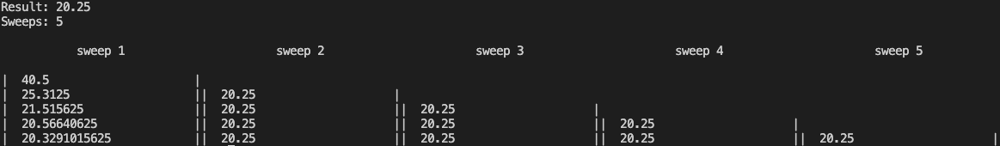

# Romberg Intergration

Romberg Integration is a numerical technique used to find an approximation for mathematical functions that cannot be easily integrated. This project allows the integral of a function to be calculated using Romberg Integration. It is designed to be used by someone with a small amount of programming experience and little to no knowledge of Rust.

Romberg Integration technique involves iteration; generally the more iterations you do the more accurate your approximation will be. However, sometimes the answer is reached with very few iterations. You can tell when this is the case when an iteration produces values that are all the same. Making a Romberg table can be helpful for visualizing this. With this program, it is better to start with a few iterations (~5) and look at the table to see if this is the case rather than starting with more iterations and potentially wasting computing power and time.  Here is an example where the answer could be reached in just 2 iterations (but 5 were used):




## Setup
- Must have [Rust](https://www.rust-lang.org/tools/install) setup on your machine (_very_ simple)

## Usage
You can configure the following values:
1. function to integrate
2. lower limit of integration
3. upper limit of integration
4. number of iterations to be performed by the Romberg Algorithm
5. whether to print the Romberg table produced in the process

The only file that needs to be modified for this to work is `config.rs`. This file contains the `Values` struct that will hold the above config variables. NOTE: the struct declaration should not be touched. The `main.rs` file uses the default values of this struct to perform the algorithm, so to configure the algorithm you just have to change the default values to whatever you want. For example, if you wanted to change the lower bound to be 2.0 and the upper bound to be 4.0, your default values would look like
```
impl Default for Values {
    fn default() -> Self {
        Values {
            equation: integrand,
            lower_bound: 0.0, // EDIT ME! (must be f64)
            upper_bound: std::f64::consts::PI, // EDIT ME! (must be f64)
            num_iterations: 4, // EDIT ME! (must be usize)
            print_table: true // EDIT ME!
        }
    }
}
```
Note: the algorithm will run faster if `print_table` is set to `false`. Also, the table works best for low iteration counts and will get jumbled if `num_iterations` is set above ~6, depending on your screen size.

You could also change what function you want to integrate by modifying the `integrand` function. For example, to make it the linear function 3x+2, it would look like
```
// Edit this function - make it whatever you want it to be as long as it returns f64
fn integrand(x: f64) -> f64 {
    3*x + 2
}
```
That's it!  Now just compile and run:
- To run, cd to `src` and run `rustc main.rs`
- Run the binary that was just generated. May vary by operating system, but on mac run `./main`

## Limitations / Guidelines
- when customizing the function to integrate, all numers must be expressed as floats (e.g., 4 -> 4.0) to prevent the compiler from complaining
- num_iterations must be > 0
- lower_bound must be < upper_bound
- function must be continuous on [lower_bound, upper_bound] and differentiable on (lower_bound, upper_bound)
- large answers may lose precision (e.g., integrating x^22 from 0 to 11 with 9 iterations)
    - in general, avoid using excessively large numbers for values upper and lower bounds